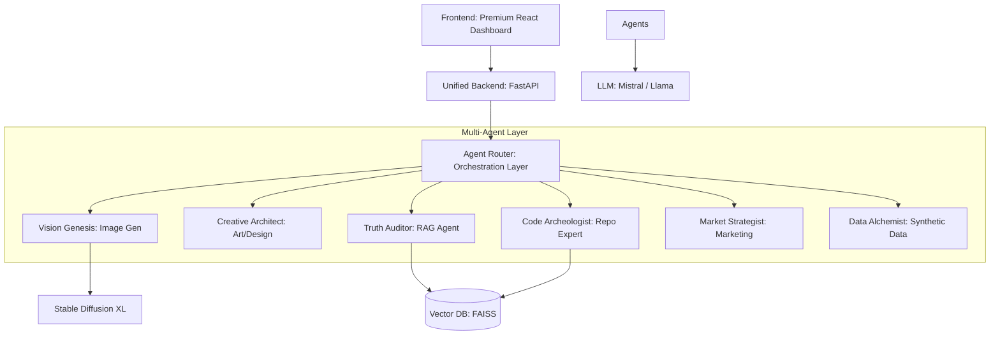

# AI Super Studio - Technical Blueprint (Phase 2)

## 1. System Architecture

**AI Super Studio** is a Multi-Agent Generative AI Platform. It uses an intelligent **Agent Router** to coordinate specialized AI entities, unified under a high-performance FastAPI backend.



### Key Components:
- **Unified Backend**: A single-port FastAPI service managing all agent lifecycles via the `/execute-workflow` endpoint.
- **Multi-Modal Agents**: Agents capable of processing text and generating images (via Vision Genesis).
- **Dynamic RAG**: A FAISS-backed knowledge system with a dedicated ingestion API (`/rag/ingest`).
- **Premium UI**: A glassmorphic, midnight-themed dashboard using React for a state-of-the-art user experience.

---

## 2. Directory Structure

```text
ace.5.hack/
├── backend/
│   ├── main.py                 # Platform Entry Point
│   ├── api/
│   │   └── routes.py           # Unified Workflow & RAG Ingest Routes
│   ├── orchestrator/
│   │   └── agent_router.py     # Intelligent Dispatcher
│   ├── agents/                 # Specialized AI Entity Definitions
│   │   ├── image_gen_agent.py
│   │   ├── hallucination_agent.py
│   │   └── ...
│   ├── llm/
│   │   └── llm_service.py      # Core LangChain Engine
│   └── rag/
│       └── vector_store.py     # FAISS Implementation
├── static_frontend.html        # Premium Midnight Dashboard
├── start_multi_agent.py        # Unified Platform Launcher
└── .env                        # Credentials (HF_TOKEN)
```

---

## 3. API Endpoints

| Endpoint | Method | Description |
|---|---|---|
| `/api/v1/execute-workflow` | POST | Dispatches a prompt to a specific agent. |
| `/api/v1/rag/ingest` | POST | Dynamically adds knowledge to the FAISS store. |
| `/api/v1/health` | GET | Checks system and agent status. |

---

## 4. Operational Instructions

1. **Start Platform**: `python start_multi_agent.py`
2. **Access Dashboard**: `http://127.0.0.1:3000/static_frontend.html`
3. **API Docs**: `http://127.0.0.1:8000/docs`
